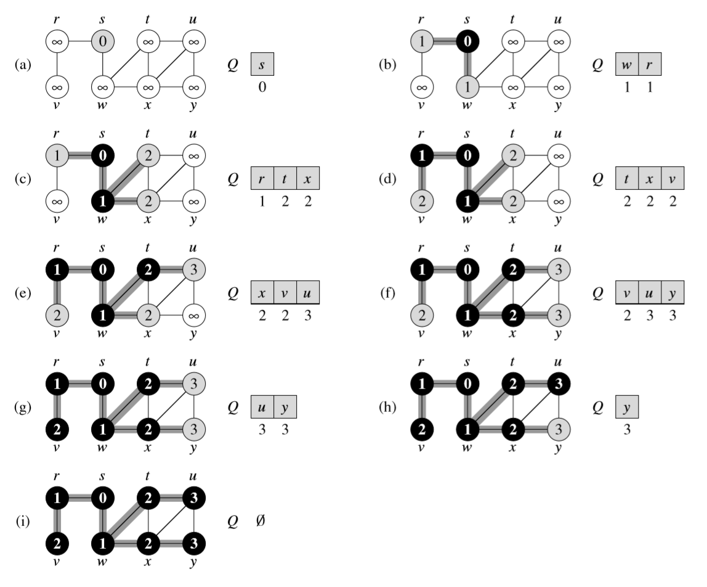

# Breadth-First Search (BFS)

#### [🏡 Home](index.html) ◾ [📚 Repo](https://github.com/jack23247/ricettario)

---

## Descrizione

Il **BFS** è uno degli algoritmi più semplici per la ricerca su un grafo, e un
archetipo per molti algoritmi sui grafi orientati e non.

Dato un grafo della forma $G=(V,E)$, e un **vertice sorgente** $s$, il BFS
esplora sistematicamente gli archi $E$ di $G$ per trovare ogni vertice
raggiungibile a partire da $s$. Inoltre esso computa la distanza tra $s$ ed ogni
vertice raggiungibile da esso, e produce un **Breadth-First Tree** di radice
$s$ che contiene tutti i vertici raggiungibili. Per ogni vertice $v$ nel BFT, il
percorso da $s$ a $v$ è un "percorso più breve", ovvero quello che contiene il
minor numero di archi.

Il BFS si chiama così perché espande uniformemente la frontiera dei vertici
scoperti, ovvero scopre tutti i vertici a distanza $k$ da $s$ prima di scoprire
quelli a distanza $k+1$.

Per tenere traccia dei progressi, il BFS "colora" ogni vertice di bianco, grigio
o nero: tutti i vertici sono colorati inizialmente di bianco, vengono colorati
di grigio quando parzialmente esplorati e, infine, colorati di nero quando
completamente esplorati. Per esplorare i vertici adiacenti si utilizza la
matrice o la lista di adiacenza associata al grafo.

Il BFS usa una serie di variabili di supporto, tra cui $color[u]$ e $\pi(u)$
(predecessore). La distanza tra $s$ e il vertice $u$ inoltre è salvata in
$d[u]$. Per gestire i vertici grigi inoltre, l'algoritmo usa una coda FIFO $Q$.

## Algoritmo

```pascal
procedure BFS(G, s)
	color[s] := GRAY
	d[s] := 0
	π[s] := NIL
	for vertex u in V[G]-{s} do
		color[u] := WHITE
		d[u] := ∞
		π[u] := NIL
	end
	ENQUEUE(Q, s)
	Q = {}
	while Q != {} do
		u := DEQUEUE(Q)
		for vertex v in ADJ(u) do
			if color[v] = WHITE then
				color[v] := GRAY
				d[v] := d[u] + 1
				π[v] := u
				ENQUEUE(Q, v)
			end
		end
		color[u] := BLACK
	end
end

```

## Funzionamento

Simulazione del funzionamento di un algoritmo BFS su un grafo non orientato, a
partire dal vertice $s$.



## Tempi

$\text{O}(|V|+|E|)$ con $|V|\gt|E|\rarr\Theta(|V|)$