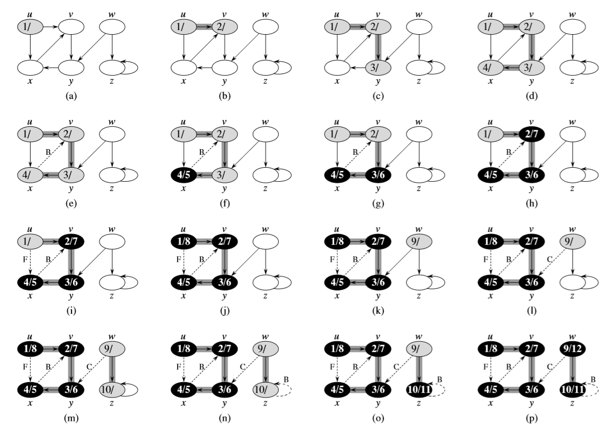

# Depth-First Search (DFS)

## Descrizione

La strategia impiegata dall'algoritmo DFS è di andare a cercare nel grafo in
profondità quando possibile. Nella ricerca DFS, gli archi vengono esplorati
partendo dall'ultimo vertice $v$ che ha ancora archi inesplorati. Quando tutti
gli archi sono stati esplorati, l'algoritmo "torna indietro" per esplorare gli
archi uscenti da $v$. Il processo continua finché tutti i vertici raggiungibili
a partire dal vertice di partenza $s$. Se ci sono altri vertici non esplorati,
uno di essi è selezionato come nuova sorgente e la ricerca viene ripetuta a
partire da quel vertice. Il processo termina quando non rimangono vertici
inesplorati.

Come nella ricerca BFS, quando un vertice $v$ viene scoperto durante la
scansione della lista di adiacenza di un vertice $u$ già scoperto, esso
viene registrato come $\pi[v]=u$.

Al contrario della ricerca BFS, il cui sotto-grafo dei predecessori forma un
albero, il sotto-grafo dei predecessori prodotto dalla ricerca DFS può essere
composto da vari alberi, poiché la ricerca può essere ripetuta partendo da
varie sorgenti.

Oltre a creare foreste, la ricerca DFS imposta anche una **timestamp** per
ogni vertice: ogni vertice ha due timestamp, il tempo di **discovery** $d[v]$
e il tempo di **fine** della ricerca sulla lista di adiacenza $f[v]$. Per ogni
vertice $v$, quindi, vale la relazione $d[u]\lt f[u]$. Le timestamp sono
utilizzate in vari algoritmi sui grafi e sono generalmente utili per capire
il funzionamento della ricerca DFS.

Il vertice $u$ è bianco prima del tempo $d[u]$, grigio tra $d[u]$ e $f[u]$ e
nero dopo $f[u]$.

## Algoritmo

```pascal
procedure DFS(G)
	for vertex v in V[G] do
		color[u] := WHITE
		π[u] := NIL
	end
	time := 0
	for vertex u in V[G] do
		if color[u] = WHITE then
			DFS-VISIT(u)
		end
	end
end
```

```pascal
procedure DFS-VISIT(u)
	color[u] := GRAY	// Il vertice bianco u e' stato scoperto
	time := time + 1
	d[u] := time
	for vertex v in ADJ(u) do	// Esploro tutti gli archi (u, v)
		if color[v] = WHITE then
			π[v] := u
			DFS-VISIT[v]
		end
	end
	color[u] := BLACK	// La visita di u e' terminata
	f[u] := time
	time := time + 1
end
```

## Funzionamento

