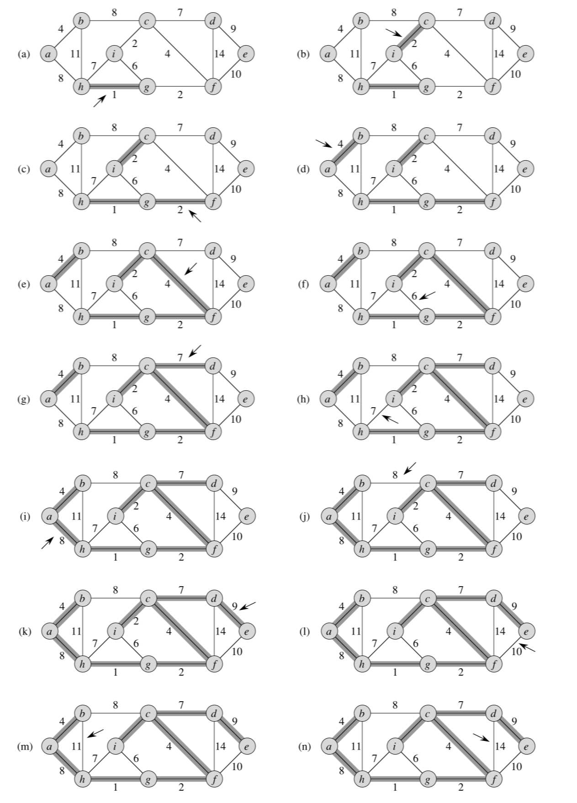

# Kruskal

#### [🏡 Home](index.html) ◾ [📚 Repo](https://github.com/jack23247/ricettario)

---

## Descrizione

L'algoritmo di Kruskal è una variazione dell'algoritmo MST in cui l'insieme $A$ è una foresta. L'algoritmo è basato direttamente sull'algoritmo GENERIC-MST e trova un arco sicuro da aggiungere alla foresta trovando, tra tutti gli archi che connettono due alberi, l'arco $(u,v)$ di peso minimo, e chiamiamo $C_1$ e $C_2$ i due alberi connessi da $(u,v)$.

L'algoritmo di Kruskal usa un approccio greedy, perché ad ogni iterazione aggiunge alla foresta un arco di peso minore possibile.

L'algoritmo usa una struttura dati, in questo caso un **disjoint-set** per mantenere vari insiemi disginti contenenti i vertici in un albero della foresta corrente.

Sono definite le seguenti operazioni sulla struttura:
 - `FIND-SET(u)` restituisce un elemento caratteristico dell'insieme che contiene `u`, in modo che possiamo determinare se due elementi `u` e `v` appartengano allo stesso insieme testando l'uguaglianza tra `FIND-SET(u)` e `FIND-SET(v)`.
 - `UNION` permette di unire vari alberi.

## Algoritmo

```pascal
procedure MST-KRUSKAL(G,w)
	A := {}
	for vertex v in V[G] do
		MAKE-SET(v)
	end
	"ordina gli archi di E[G] in ordine non-decrescente di peso w"
	for edge (u,v) in E[G] do
		if FIND-SET(u) != FIND-SET(v) then
			A := A + {(u,v)}
			UNION(u,v)
		end
	end
	return A
end
```

L'insieme $A$ viene inizializzato e vengono creati $|V|$ alberi, uno contenente ogni vertice. Gli archi di $E$ sono ordinati in ordine non-decrescente di peso. Il ciclo controlla se, per ogni arco $(u,v)$, i vertici $u$ e $v$ fanno parte dello stesso albero. In caso affermativo, l'arco $(u,v)$ non può essere aggiunto alla foresta senza creare un ciclo, e l'arco deve essere scartato.
Nel caso invece che i due vertici appartengano ad alberi diversi, l'arco $(u,v)$ viene aggiunto all'insieme $A$ e infine i vertici dei due alberi vengono uniti.

## Funzionamento



## Tempi

Il tempo di esecuzione dell'algoritmo per un grafo $G=(V,E)$ dipende dall'implementazione del disjoint-set. Basandoci sulla miglior implementazione possibile, dobbiamo considerare $|V|$ operazioni `MAKE-SET()` e $\text{O}(E)$ operazioni `FIND-SET()` e `UNION`. Esse richiedono $\text{O}((V+E)\alpha(V))$ tempo, dove $\alpha$ è una funzione che cresce lentamente. Dato che $G$ è connesso, vale $|E|\geq|V|−1$, quindi le operazioni disjoint-set richiedono $\text{O}(E α(V))$ tempo. Inoltre, dato che $\alpha(|V|)=\text{O}(\log V)=\text{O}(\log E)$, osservando inoltre che $|E|\lt|V|^2$, si ha che $\log|E|=\text{O}(\log V)$, quindi possiamo affermare che il tempo è:
$$
\text{O}(E\log V)
$$