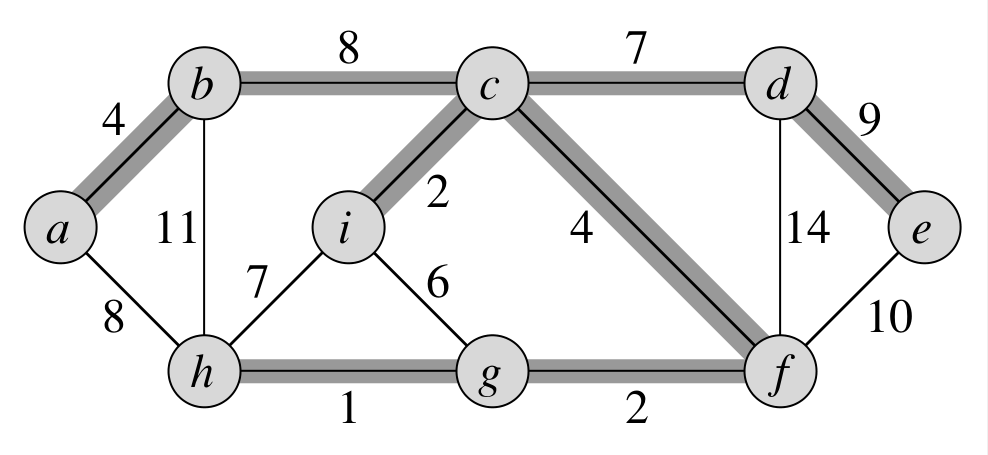

# Minimum Spanning Tree

#### [🏡 Home](index.html) ◾ [📚 Repo](https://github.com/jack23247/ricettario)

---

## Descrizione

Dato un grafo pesato $G$, un **MST** è un suo sotto-grafo aciclico che ne
connette tutti i vertici e il cui peso totale è minimo, ovvero vale:

$$
T\subseteq E\\\ \\
w(T) = \sum_{(u,v)\in T}w(u,v)
$$

Dato che $T$ è aciclico e connette tutti i vertici, deve formare per forza un
albero che chiamiamo, appunto, **spanning tree**. Il problema associato alla
costruzione dell'MST viene chiamato **minimum-spanning-tree problem** o
**problema MST**. La figura seguente mostra un esempio di un grafo connesso e
dell'MST associato.



Esistono vari algoritmi per risolvere il problema MST, tra i quali notiamo
quelli di Kruskal e di Prim. Essi sono algoritmi **greedy**, in quanto ad ogni
passaggio, tra le possibili scelte, effettua sempre quella migliore possibile
in quel dato momento. Dato che questa classe di algoritmi non prende in
considerazione le scelte effettuate nei passaggi precedenti, solitamente non è
in grado di trovare soluzioni globalmente ottime a un problema. Nel caso del
problema MST, tuttavia, si può dimostrare che l'approccio greedy è in grado di
trovare la soluzione ottima al problema.

Consideriamo di avere un grafo non diretto e connesso $G=(V,E)$ con una funzione peso $w:E\rarr R$, e che vogliamo determinare un MST per $G$. Gli algoritmi di Kruskal e Prim utilizzano una strategia greedy condivisa che può essere riassunta dal seguente algoritmo "generico", che accresce l'MST un arco alla volta. L'algoritmo gestisce una serie di archi $A$, mantenendo la seguente invariante di ciclo: *Prima di ogni iterazione, $A$ è un sottoinsieme di un MST*. Ad ogni passaggio troverà un arco $(u,v)$ che può essere aggiunto ad $A$ senza violare l'invariante. Possiamo definire quest'ultimo un **arco sicuro** (**safe edge**), dato che aggiungendolo ad $A$ non corriamo il rischio di violare l'invariante.

## Algoritmo

```pascal
procedure GENERIC-MST(G, w)
	A := {}
	while "A non è un MST" do
		"trova un arco sicuro (u,v)"
		A := A + {(u,v)}
	end
	return A
end
```

Notiamo che:
 - L'inizializzazione dell'insieme $A$ soddisfa trivialmente l'invariante.
 - Il ciclo `while` mantiene l'invariante aggiungendo solo archi sicuri.
 - Tutti gli archi aggunti ad $A$ si trovano in un MST, quindi l'insieme restituito deve essere necessariamente un MST.

La parte complicata è trovare un arco sicuro. Questo deve esistere perché, quando l'"istruzione" viene eseguita, l'invariante ci assicura che esista un MST $T$ tale che $A\subseteq T$. All'interno del ciclo, $A$ deve essere un sottoinsieme di $T$, e quindi esisterà un arco $(u,v)\in T$ tale che $(u,v)\in A$ e $(u,v)$ è sicuro.

> Una spiegazione più esaustiva di "sicurezza" di un arco è presentata in *Introduction to Algorithms*, pagg. 563-567.